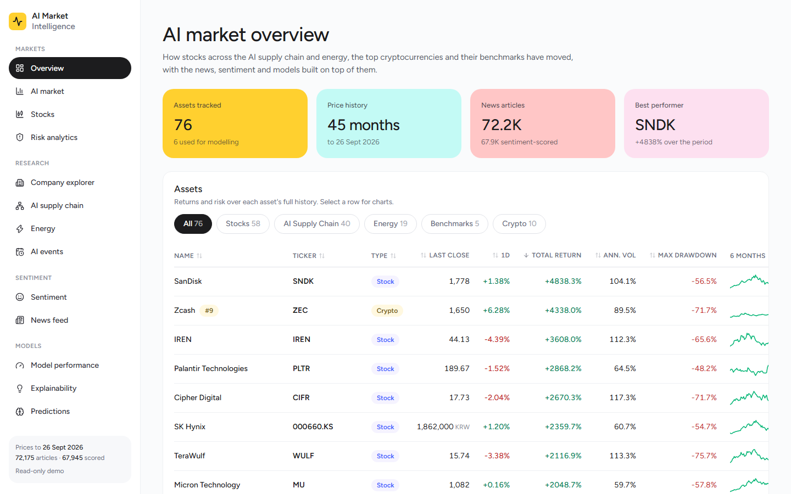
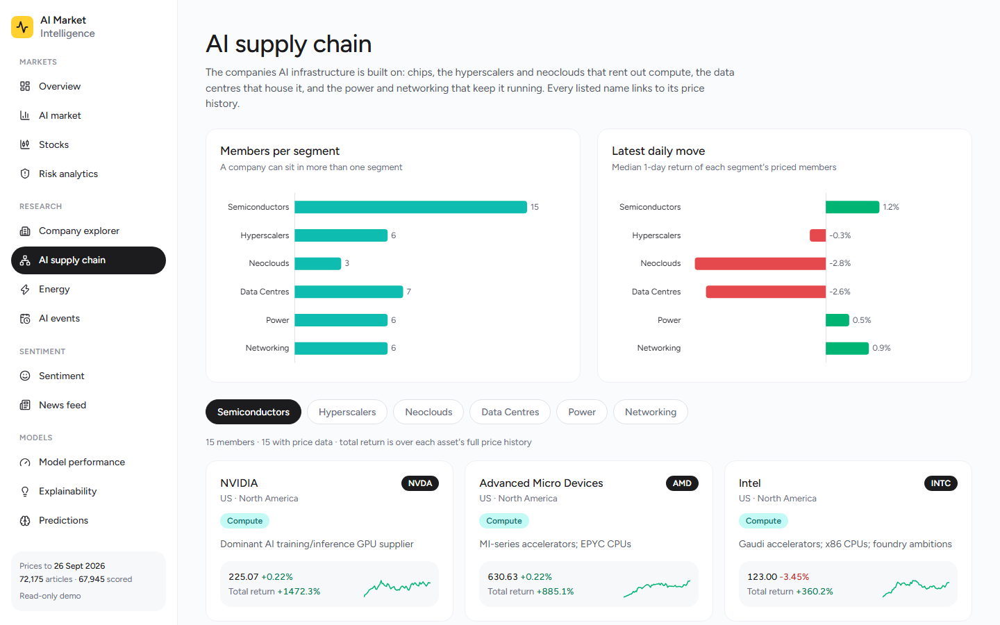
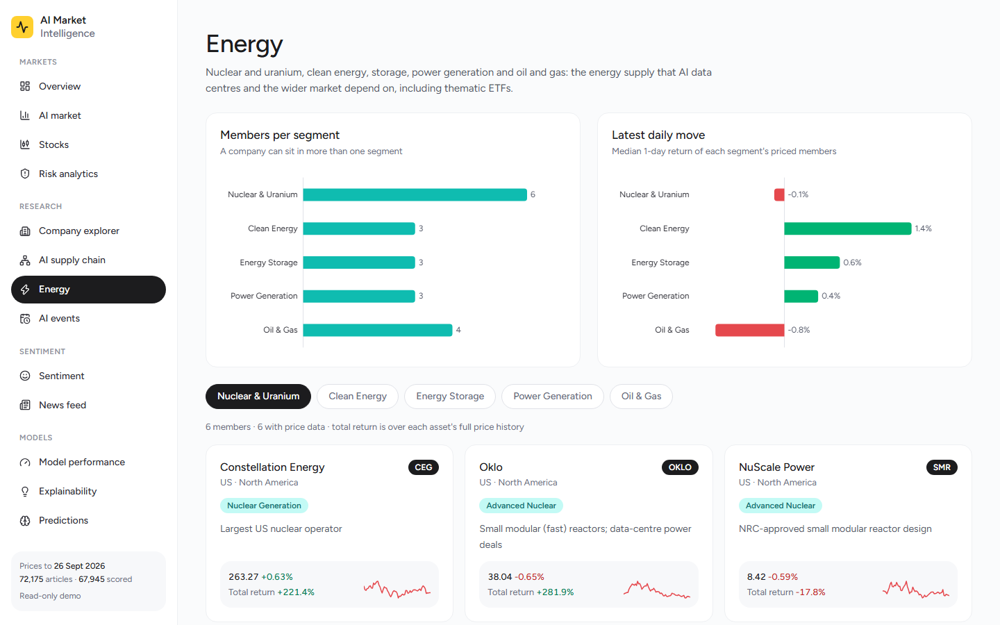
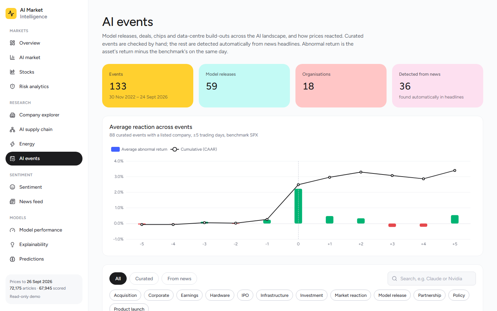
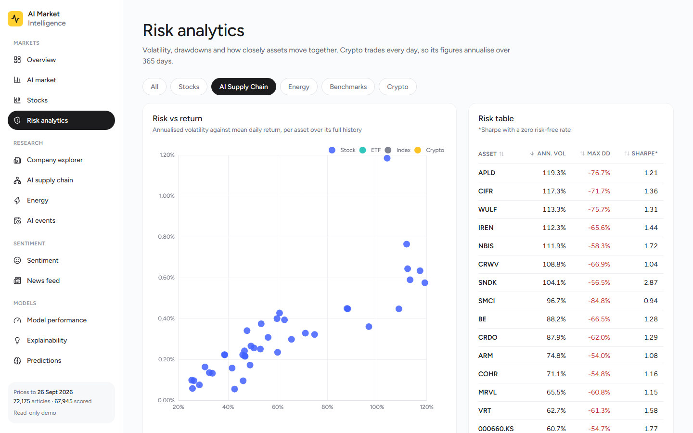
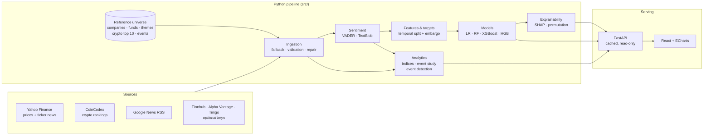

<div align="center">


# AI Market Intelligence

**Market intelligence for AI, semiconductors, energy and crypto: ingestion, news sentiment, time-aware machine learning, event studies and a web dashboard.**

[](https://ai-market-intelligence-self.vercel.app)


[**Live demo**](https://ai-market-intelligence-self.vercel.app) · [Quick start](#quick-start) · [Architecture](#architecture) · [Documentation](#documentation)



</div>

---

## Why this exists

AI is no longer one trade. It runs from lithography machines and memory chips, through hyperscalers and GPU clouds, to the data centres and power plants that keep them running, and it moves crypto and broad benchmarks along the way. This project tracks that whole landscape as one consistent market universe. On top of it, it asks measurable questions:

- How have the AI supply chain, energy names and crypto performed, and how risky were they?
- How do prices react to model releases, mega-deals and infrastructure announcements?
- Does news sentiment add anything to short-horizon direction prediction, beyond price-based features?

It is a **research and analytics platform**, not a trading system. Model outputs are probabilistic research signals, not investment advice.

## Highlights

- **76 instruments in one universe.** 58 stocks, 5 benchmarks, 3 thematic energy ETFs and the **top 10 cryptocurrencies by market cap**, re-ranked from CoinCodex on every ingestion run. A company can sit in several themes and is always a priced, analysable asset.
- **Theme taxonomy.** *AI Supply Chain* (Semiconductors, Hyperscalers, Neoclouds, Data Centres, Power, Networking), *Energy* (Nuclear & Uranium, Clean Energy, Storage, Power Generation, Oil & Gas), *AI Models* and *AI Applications*.
- **AI events timeline.** 97 curated events, from ChatGPT to the latest Claude, GPT, Gemini, Grok, DeepSeek and Qwen releases. More are **detected automatically from news headlines**, and every curated event with a listed company feeds an abnormal-return event study.
- **News sentiment.** More than 72,000 articles are entity-matched and scored with VADER and TextBlob at article × model grain.
- **Honest ML.** 5-day directional classification with a temporal split and embargo, and training-only preprocessing. PR-AUC is the headline metric, reported against naive baselines, with robustness and ablation checks.
- **Explainability.** Tree importance, permutation importance, coefficients and SHAP are compared across models.
- **Resilient ingestion.** Provider adapters, retries, fallbacks, schema validation, round-trip storage checks and documented data-quality repairs.
- **Web app.** React, TypeScript and ECharts on a FastAPI backend, with 14 pages. It deploys as a read-only public demo on Vercel or Docker.

<table>
  <tr>
    <td width="50%"></td>
    <td width="50%"></td>
  </tr>
  <tr>
    <td align="center"><b>AI supply chain</b>: six segments, every member linked to its price history</td>
    <td align="center"><b>Energy</b>: nuclear, clean energy, storage, generation, oil and gas, plus ETFs</td>
  </tr>
  <tr>
    <td width="50%"></td>
    <td width="50%"></td>
  </tr>
  <tr>
    <td align="center"><b>AI events</b>: curated and news-detected, with price reactions</td>
    <td align="center"><b>Risk analytics</b>: volatility, drawdowns and correlation by category</td>
  </tr>
</table>

---

## Architecture



The pipeline writes its outputs to `data/` and `outputs/`. The API only reads them: it caches each file until it changes, and never fetches data or trains a model on a request. [`src/ingestion/universe.py`](src/ingestion/universe.py) is the single source of truth for "which instruments do we track", so no ticker list is hard-coded downstream.

---

## Market universe

| Category | Contents | Defined in |
|---|---|---|
| **Stocks** | 58 listed companies, including NVIDIA, TSMC, ASML, SanDisk, Intel, IBM, ServiceNow, Nebius, IREN, TeraWulf, Cipher Digital, Constellation Energy and Amprius | `data/reference/companies.csv` |
| **AI Supply Chain** | Semiconductors · Hyperscalers · Neoclouds · Data Centres · Power · Networking | `data/reference/themes.csv` |
| **Energy** | Nuclear & Uranium · Clean Energy · Energy Storage · Power Generation · Oil & Gas, including NCLR, INRG and WENS | `data/reference/themes.csv` |
| **Benchmarks** | S&P 500 · Nasdaq-100 · Vanguard FTSE All-World · Vanguard FTSE Emerging Markets · iShares Semiconductor | `data/reference/funds.csv` |
| **Crypto** | Top 10 by market cap (currently BTC, ETH, USDT, BNB, XRP, USDC, SOL, TRX, ZEC, DOGE), plus pinned modelling assets | generated by `src.ingestion.crypto_universe` |

Private AI labs (OpenAI, Anthropic, xAI, DeepSeek, Moonshot and others) are first-class entities for news and events, even without a price series. Full taxonomy, listing choices and data-quality notes are in [`UNIVERSE.md`](UNIVERSE.md).

## Data sources

| Provider | Used for | Key required |
|---|---|---|
| Yahoo Finance (yfinance) | Prices for stocks, ETFs, indices and crypto; latest ticker news | No |
| CoinCodex | Crypto market-cap ranking; crypto price fallback | No |
| Google News RSS | Keyword news, including private AI labs | No |
| Tiingo | Equity price fallback | `TIINGO_API_TOKEN` |
| Alpha Vantage | Historical news (two or more years) | `ALPHA_VANTAGE_API_KEY` |
| Finnhub | Dense recent company news | `FINNHUB_API_KEY` |

Every key is optional: the pipeline runs end to end with none set. Run `python -m src.ingestion.probe_providers` to see what your free-tier keys actually allow.

---

## Quick start

**Prerequisites:** Python 3.13 and Node.js 20 or later.

```bash
git clone https://github.com/garcane/Market-Intelligence-Analysis.git
cd Market-Intelligence-Analysis

python -m venv .venv
source .venv/bin/activate            # Windows: .venv\Scripts\Activate.ps1
pip install -r requirements.txt

cp .env.example .env                 # optional: add any API keys you have
pytest                               # 212 tests, no network access needed
```

### Run the pipeline

Each stage reads the previous stage's output from `data/`:

```bash
# 1. Ingest: the six modelling assets with news, then the full universe
python -m src.ingestion.run_ingestion --assets NVDA,MSFT,TSM,BTC,ETH,SOL --start 2023-06-01
python -m src.ingestion.run_ingestion --start 2023-01-01 --skip-news   # re-ranks the crypto top 10 first
python -m src.ingestion.run_news_backfill                               # run daily to build news history

# 2. Sentiment, features, targets and the temporal split
python -m src.sentiment.run_sentiment
python -m src.features.run_features
python -m src.features.run_target
python -m src.models.run_split

# 3. Models and diagnostics
python -m src.models.train_baselines
python -m src.models.run_explain
python -m src.models.run_robustness
python -m src.models.run_ablation
python -m src.models.run_model_plots

# 4. Market analytics
python -m src.analytics.run_eda
python -m src.analytics.run_indices
python -m src.analytics.event_detection
python -m src.analytics.run_event_study
python -m src.analytics.run_sentiment_viz
```

### Run the web app

```bash
cd web && npm install && npm run build && cd ..
uvicorn api.main:app                 # http://127.0.0.1:8000
```

For hot reload, run `npm run dev` in `web/` alongside `uvicorn api.main:app --reload`. In local mode, the **Pipeline** page can re-run any stage from the browser (localhost only).

---

## Deployment

The public deployment runs in `APP_MODE=public`: read-only, with no pipeline endpoints and no API docs, and price rows from providers whose licence forbids redistribution are withheld.

**Vercel** (live at [ai-market-intelligence-self.vercel.app](https://ai-market-intelligence-self.vercel.app)). [`app.py`](app.py) is the entry point and [`pyproject.toml`](pyproject.toml) holds the slim runtime dependencies. [`.vercelignore`](.vercelignore) is an allowlist, so only the app, the built frontend and the data snapshot are uploaded, never `.env`.

```bash
cd web && npm run build && cd ..
npx vercel deploy --prod
```

**Docker**

```bash
docker build -t ai-market-intelligence .
docker run -p 8000:8000 ai-market-intelligence
```

Both ship a snapshot of the pipeline's outputs. To refresh the demo, run the pipeline locally and redeploy. See [`WEB_APP.md`](WEB_APP.md) for modes, endpoints and verification steps.

---

## Model results

The task is to predict whether an asset's **5-day forward return exceeds +2%**. The data has 3,345 training rows and 981 validation rows, with an embargo between them. Metrics are on the validation split:

| Model | PR-AUC | ROC-AUC |
|---|---:|---:|
| HistGradientBoosting | **0.422** | **0.598** |
| Random Forest | 0.421 | 0.583 |
| XGBoost | 0.414 | 0.587 |
| Logistic Regression | 0.395 | 0.576 |
| Majority-class baseline | 0.353 | 0.500 |
| Random baseline | 0.339 | 0.481 |

The web app draws these as interactive ROC and precision-recall curves, and recomputes each model's confusion matrix live as you move the decision threshold.

What the numbers do and don't show:

- **The lift is modest and real, but the ranking isn't settled.** Tree ensembles beat the baselines. The top two models, though, are only 0.001 PR-AUC apart, less than seed-to-seed noise ([`ROBUSTNESS.md`](ROBUSTNESS.md)).
- **Sentiment adds nothing measurable yet.** Sentiment covers under 1% of training rows, so its effect sits inside seed noise ([`ABLATION_STUDY.md`](ABLATION_STUDY.md)).
- **Suspiciously good results are diagnosed, not celebrated.** A high AUC triggers a leakage check, and overfit early tree models were regularised ([`MODELS.md`](MODELS.md)).

---

## Engineering and data integrity

| Risk | Safeguard |
|---|---|
| Temporal leakage | Time-ordered split with an embargo; features only use data available at *t* |
| Preprocessing leakage | Scalers and encoders fit on training data only |
| Target leakage | Target and split columns are excluded from feature sets by construction |
| Provider outages | Per-provider retries with ordered fallbacks and health reporting |
| Bad vendor data | Schema and OHLC validation, logged repairs, and a round-trip storage check before any write |
| Ambiguous tickers | A crypto symbol from Yahoo is used only if its price matches CoinCodex's |
| Silent regressions | 212 unit, API and end-to-end tests, all offline and deterministic |
| Secrets | Keys read from the environment only; errors redact them; deployments use an allowlist |

Every failure found during development is recorded, with its root cause and fix, in [`FAILURE_LOG.md`](FAILURE_LOG.md).

---

## Project structure

```text
├── api/                  FastAPI app: routers, cached read-only data access, settings
├── app.py                Vercel entry point (public mode)
├── data/
│   ├── reference/        Universe: companies, funds, themes, crypto candidates, events
│   ├── raw/              Ingested prices, news and sentiment   (generated, gitignored)
│   └── processed/        Features, targets, reports            (generated, gitignored)
├── docs/screenshots/     Images used in this README
├── notebooks/            Exploration and reporting notebooks
├── outputs/              Figures and trained models            (generated, gitignored)
├── src/
│   ├── ingestion/        Providers, orchestration, validation, universe, crypto ranking
│   ├── sentiment/        Entity matching and scoring
│   ├── features/         Market, cross-sectional and sentiment features; targets
│   ├── models/           Datasets, splits, training, evaluation, explainability
│   └── analytics/        Indices, event study, event detection, market statistics
├── tests/                Offline test suite
├── web/                  React 19 + Vite + TypeScript + Tailwind + ECharts frontend
├── Dockerfile            Public read-only image
└── *.md                  Methodology documents (see below)
```

---

## Documentation

| Topic | Documents |
|---|---|
| Universe and data | [`UNIVERSE.md`](UNIVERSE.md) · [`DATA_MODEL.md`](DATA_MODEL.md) · [`API Reference Documents/`](API%20Reference%20Documents/) |
| Features and targets | [`FEATURES.md`](FEATURES.md) · [`TARGET.md`](TARGET.md) · [`SPLIT.md`](SPLIT.md) |
| Modelling | [`MODELS.md`](MODELS.md) · [`EXPLAINABILITY.md`](EXPLAINABILITY.md) · [`ROBUSTNESS.md`](ROBUSTNESS.md) · [`ABLATION_STUDY.md`](ABLATION_STUDY.md) |
| Market analytics | [`EVENT_STUDY.md`](EVENT_STUDY.md) · [`INDICES.md`](INDICES.md) · [`VISUALISATION.md`](VISUALISATION.md) · [`ANALYSIS_REPORT.md`](ANALYSIS_REPORT.md) |
| Web app | [`WEB_APP.md`](WEB_APP.md) |
| Engineering | [`SOFTWARE_ENGINEERING.md`](SOFTWARE_ENGINEERING.md) · [`TESTING.md`](TESTING.md) · [`REPRODUCIBILITY.md`](REPRODUCIBILITY.md) · [`PERFORMANCE_REVIEW.md`](PERFORMANCE_REVIEW.md) |
| Project history | [`CHECKPOINT.md`](CHECKPOINT.md) · [`FAILURE_LOG.md`](FAILURE_LOG.md) · [`FINAL_QA.md`](FINAL_QA.md) · [`PROJECT_AUDIT.md`](PROJECT_AUDIT.md) |

The project began as a two-stock Bokeh dashboard. Those original scripts and notebooks are kept in `Old Source Files/` for provenance and aren't part of the current pipeline.

---

## Disclaimer

This project is for **education, research and portfolio purposes only** and is not financial advice. It uses historical data from third-party providers, which can change, be delayed or be restricted by their terms of use. Past validation performance does not guarantee future results. The project does not place trades.

---

<div align="center">

Built by [@garcane](https://github.com/garcane)

</div>
